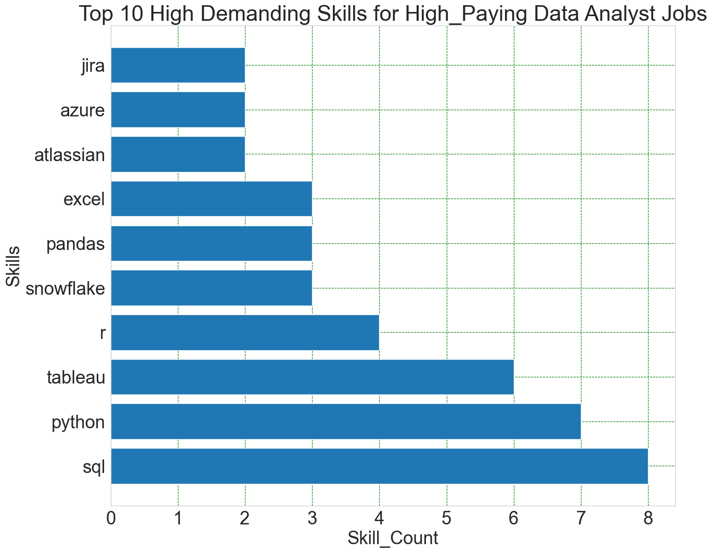

# INTRODUCTION

 This project explores  top-paying jobs,  high-demand skills, and skills where high demand meets high salary in my own role, data analytics. 

    - The dataset used for this project is available at: [DataSet](https://drive.google.com/drive/folders/1moeWYoUtUklJO6NJdWo9OV8zWjRn0rjN)
    - The developed SQL queries are available at:  [projects folder](/PROJECTS/)

# background

Driven by an interest to navigate the data analyst job market more effectively, this project was born from a desire to pinpoint top-paid and in-demand skills, streamlining others work to find optimal jobs. The result of this project is critical to those who are jobseekers or for anyone interested about the jobs and skills in data analytics roles.


### The questions I wanted to answer through my SQL queries were:
- What are the top-paying data analyst jobs?
- What skills are required for these top-paying jobs?
- What skills are most in demand for data analysts?
- Which skills are associated with higher salaries?
- What are the most optimal skills to learn?

# Tools I used 

For my deep dive into the data analyst job market, I harnessed the power of several key tools:

- **SQL**: The backbone of my analysis, allowing me to query the database and unearth critical insights.
PostgreSQL: The chosen database management system, ideal for handling the job posting data.
- **Visual Studio Code**: My go-to for database management and executing SQL queries.
- **JupyterNotebook**: used to generate the visualizations of the sql query resultsr 
- **Git & GitHub**: Essential for version control and sharing my SQL scripts and analysis, ensuring collaboration and project tracking.


# The Analysis
Each query for this project aimed at investigating specific aspects of the data analyst job market. Here’s how each question is approached.

### 1.  Top Paying Data Analyst Jobs
To identify the highest-paying roles, I filtered data analyst positions by average yearly salary and location, focusing on remote jobs. This query highlights the high paying opportunities in the field for remote workers.

```sql
SELECT	
	job_id,
	job_title,
	job_location,
	job_schedule_type,
	salary_year_avg,
	job_posted_date,
    name AS company_name
FROM
    job_postings_fact
LEFT JOIN company_dim ON job_postings_fact.company_id = company_dim.company_id
WHERE
    job_title_short = 'Data Analyst' AND 
    job_location = 'Anywhere' AND 
    salary_year_avg IS NOT NULL
ORDER BY
    salary_year_avg DESC
LIMIT 10;
```
|Job_id | Job_title| Job_Schedule_Type|year_AVG_salary| Company|
|-------|---------------------------------|-------------|-------|-------|
|226942	|Data Analyst	                  |Full-time  |650000	|Mantys|
|547382	|Director of Analytics	          |Full-time	|336500	|Meta|
|552322	|Associate Director-Data Insights  |Full-time	|255829.5	|AT&T|
|99305	|Data Analyst, Marketing	           |Full-time	|232423	|Pinterest Job Advertisements|
|1021647	|Data Analyst (Hybrid/Remote)	   |Full-time	|217000	|Uclahealthcareers|
|168310	|Principal Data Analyst (Remote)	  |Full-time	|205000               |SmartAsset|
|731368	|Director, Data Analyst - HYBRID	  |Full-time	|189309	|Inclusively|
|310660	|Principal Data Analyst, AV Performance Analysis	|Full-time	|189000	|Motional|
|1749593	|Principal Data Analyst	Full-time	|186000	|SmartAsset|
|387860	|ERM Data Analyst	|Full-time	|184000	|Get It Recruit - Information Technology|


Here's the breakdown of the top data analyst jobs in 2023:

- **Wide Salary Range**: Top 10 paying data analyst roles span from $184,000 to $650,000, indicating significant salary potential in the field.
- **Diverse Employers**: Companies like SmartAsset, Meta, and AT&T are among those offering high salaries, showing a broad interest across different industries.
- **Job Title Variety**: There's a high diversity in job titles, from Data Analyst to Director of Analytics, reflecting varied roles and specializations within data analytics.


*Bar graph visualizing the salary for the top 10 salaries for data analysts; ChatGPT generated this graph from my SQL query results*

### 2. High_Demanding Skills for Top Paying Jobs
To understand what skills are required for the top-paying jobs, I joined the job postings with the skills data, providing insights into what employers value for high-compensation roles.

```sql
WITH top_paying_jobs AS (
    SELECT	
        job_id,
        job_title,
        salary_year_avg,
        name AS company_name
    FROM
        job_postings_fact
    LEFT JOIN company_dim ON job_postings_fact.company_id = company_dim.company_id
    WHERE
        job_title_short = 'Data Analyst' AND 
        job_location = 'Anywhere' AND 
        salary_year_avg IS NOT NULL
    ORDER BY
        salary_year_avg DESC
    LIMIT 10
)

SELECT 
skills,
count(*) as Skill_count
    
FROM top_paying_jobs
INNER JOIN skills_job_dim ON top_paying_jobs.job_id = skills_job_dim.job_id
INNER JOIN skills_dim ON skills_job_dim.skill_id = skills_dim.skill_id
group by skills
ORDER BY
    Skill_count DESC;
```

Here's the breakdown of the most demanded skills for the top 10 highest paying data analyst jobs in 2023:

- **SQL** is leading with a bold count of 8.
- **Python** follows closely with a bold count of 7.
- **Tableau** is also highly sought after, with a bold count of 6. Other skills like R, Snowflake, Pandas, and Excel show varying degrees of demand.


*Bar graph visualizing the count of skills for the top 10 paying jobs for data analysts; ChatGPT generated this graph from my SQL query results*

### 3.  In-Demand Skills for Data Analysts

|Skills  |	Demand Count|
|--------|--------------|
|SQL	 |  7291        |
|Excel	 |  4611        |
|Python	 |  4330        | 
|Tableau |  3745        |
|Power BI|	2609        |
*Table of the demand for the top 5 skills in data analyst job postings* 


### 4. Skills Based on Salary


|Skills	       |Average Salary ($)|
|--------------|------------------|
|yspark	       |208,172           |
|bitbucket     |189,155           |
|couchbase     |160,515           |
|watson	       |160,515           |
|datarobot     |155,486           |
|gitlab	       |154,500           |
|swift	       |153,750           |
|jupyter       |152,777           |
|pandas	       |151,821           |
|elasticsearch |145,000       |

### 5. Most Optimal Skills to Learn


# Conclusion
## Insights
From the analysis, several general insights emerged:

Top-Paying Data Analyst Jobs: The highest-paying jobs for data analysts that allow remote work offer a wide range of salaries, the highest at $650,000!
Skills for Top-Paying Jobs: High-paying data analyst jobs require advanced proficiency in SQL, suggesting it’s a critical skill for earning a top salary.
Most In-Demand Skills: SQL is also the most demanded skill in the data analyst job market, thus making it essential for job seekers.
Skills with Higher Salaries: Specialized skills, such as SVN and Solidity, are associated with the highest average salaries, indicating a premium on niche expertise.
Optimal Skills for Job Market Value: SQL leads in demand and offers for a high average salary, positioning it as one of the most optimal skills for data analysts to learn to maximize their market value.

## Closing Thoughts
This project enhanced my SQL skills and provided valuable insights into the data analyst job market. The findings from the analysis serve as a guide to prioritizing skill development and job search efforts. Aspiring data analysts can better position themselves in a competitive job market by focusing on high-demand, high-salary skills. This exploration highlights the importance of continuous learning and adaptation to emerging trends in the field of data analytics.

